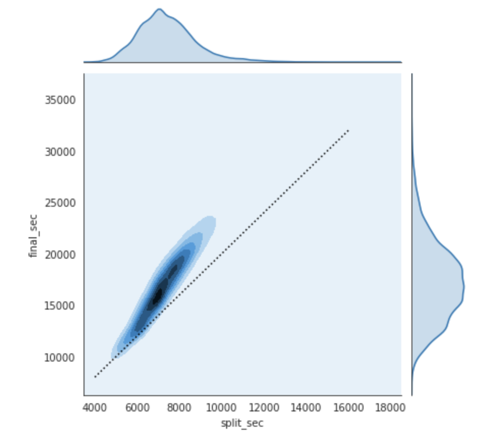

  

      <ul class="nav">
          <li><a href="{{ BASE_PATH }}/Users/llately/Desktop/Resume_Tianyu_111b.pdf">cv</a></li>
          <li><a href="https://github.com/tianyuzhanggwu">github</a></li>
          <li><a href="http://kbroman.org/blog">blog</a></li>
          <li><a href="https://https://www.linkedin.com/in/gwu-tianyu-zhang/">LinkedIn</a></li>
      </ul>
  

### Portfolio

<table class="wide">
<tr>
  <td class="left">
    
  </td>
  <td class="right">
    
  </td>
</tr>
<tr>
  <td class="left">
    
  </td>
  <td class="right">
    
  </td>
</tr>
</table>

  

      <ul class="nav">
          <li><a href="morefigs.html">see more figures</a></li>
      </ul>
  

